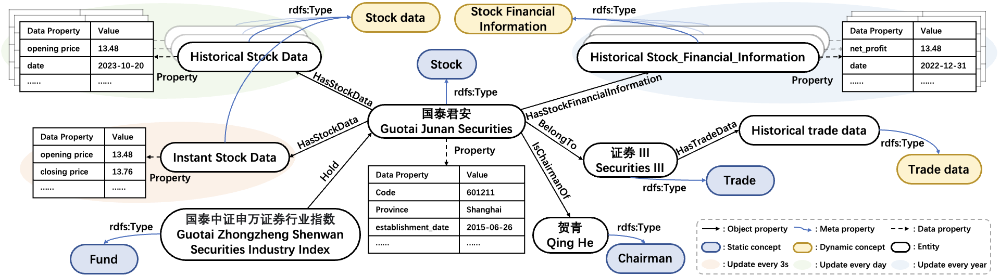
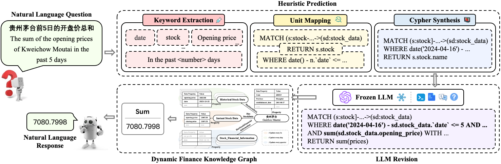

[//]: # (# FinQA)

# FinQA: A Training-free Dynamic Knowledge Graph Question Answering System in Finance with LLM-based Revision

> This is an appendix to the paper: FinQA: A Training-free Dynamic Knowledge Graph Question Answering System in Finance with LLM-based Revision

## FinQA Architecture
### Dynamic Knowledge Graph Construction



To construct an efficient structure for KG in the finance domain, we first design the core ontology with references to W3C standards, which is an efficient schema coupled with financial logic.
Then, we define different partitions for the KG management according to the evolution of entities, which ensures the efficiency of maintenance and query to the large-scale data.

#### Core Ontology Design

We hold the following principles when we design the KG ontology:
(1) The financial entities should be organized in an efficient structure, where their definition should be dis-ambiguous and their relations should be clearly identified.
(2) Financial data usually presents on sequence diagrams, so the temporal information should be included in the ontology.

#### Core Entities

In the finance domain, stocks like _Guotai Junan Securities_ are the core entities.
They are linked to different entities, which are either static (e.g., _Securities III_) or dynamic (e.g., _instant stock data_).
They are also associated with various attributes, such as _code_ and _province_, which are organized in table format.

#### Core Concepts

These are abstract types of the entities, which indicates the taxonomy of entities and are regarded as classes.
Considering entities in finance are informative with rich semantics, we define the abstract types as concepts in the ontology.
For example, _stock_, as an abstract type of _Guotai Junan Securities_, can be defined as a concept.
Similarly, _fund_ and _chairman_ are also concepts that represent abstract types.

#### Core Relations

These are edges in a KG, which model the relationship among concepts/entities.
It usually constrains the type of head entity (domain) and tail entity (range).
For example, _BelongTo_ models the association between domain _stock_ and range _trade_.
We include meta-properties _rdfs:Type_ to express the instantiation of concepts.
Besides, there is data property to describe the attributes of concepts, which may include temporal information.
As shown in the figure, the entity _instant stock data_ of _Guotai Junan Securities_ has the data properties of _opening price_ on a certain _date_.
Such that we can query the opening price of a stock on one day.

#### Knowledge Partition and Management

As we can see in the figure, we annotate concepts with different management frequencies with different colors.
For example, the concept of _stock_ has properties such as _code_, _establishment_date_, and _province_, which are static.
In contrast, the concept of _stock_data_ has entity _instant stock data_ with temporal properties updated in every 3 seconds and entity _historical stock data_ with temporal properties updated in every day.
Therefore, we partition them into different groups.
Dynamic concepts are updated according to certain cycles to support synchronized queries while the other concepts are maintained statically, which avoids dispensable updates to the entire KG.


### Training-free Knowledge Graph Question Answering



#### Heuristic Prediction

Keyword Extraction:

This step aims to identify the named entities or concepts in the question and link them to KGs.
We first collect entities/concepts and their aliases in the KG as a dictionary. 
Then we tokenize the question via Jieba toolkit(https://github.com/fxsjy/jieba).
These tokens are matched with the elements in a dictionary with the objective of maximum matching.


Unit Mapping:

With the extracted entities, we develop a collection of trigger patterns (```/assets/trigger_mapping.xlsx```) that could be identified via Regex and mapped to various parsing units, which are associated to Cypher keywords MATCH, WHERE, and RETURN.


Cypher Synthesis:

Eventually, we conduct variable alignment and clause combination to synthesize a complete Cypher query.
When there are multiple composed Cypher queries as candidates, we further rank them by measuring their Cosine Similarity between the input and candidate queries encoded by BERT.
The top-ranked Cypher is executed against the KGs.

#### LLM-based Revision

Fine-tuning:

We fine-tune Qwen1.5-14B-Chat (https://huggingface.co/Qwen/Qwen1.5-14B-Chat) with the question-GQL pairs from an open NL2GQL dataset (https://github.com/zhiqix/NL2GQL) following the Lora scheme.

> The data used for fine-tuning does not involve any knowledge from our finance KG, and the fine-tuning is merely designed to let the LLM learn cypher syntax.

There are 3862 question-GQL pairs in the dataset and the format is as follows:

<table>
	<tr style="background-color: #eff3f5;color:black">
	    <td style="text-align:center"><b>Question</b></td>
	    <td style="text-align:center"><b>Cypher</b></td>
	</tr>
	<tr style="background-color: #eff3f5;color:black">
	    <td style="text-align:center">找出名为'Tim Duncan'的球员的所有为'follow'关系的1到3度好友，并返回这些好友及其数量。</td>
	    <td style="text-align:center">MATCH p=(v:player{name:\"Tim Duncan\"})-[e:follow*1..3]->(v2:player)\nRETURN DISTINCT v2 AS Friends, count(v2)</td>
	</tr>
	<tr style="background-color: #eff3f5;color:black">
	    <td style="text-align:center">Hello, please help me find the entities and relationships related to 'Tim Duncan' at a distance of 2 to 3.</td>
	    <td style="text-align:center">MATCH (n)-[e:serve|like*2..3]->(v)\nWHERE id(n) == \"Tim Duncan\"\nRETURN e, v</td>
	</tr>
	<tr style="background-color: #eff3f5;color:black">
	    <td style="text-align:center">......</td>
	    <td style="text-align:center">......</td>
	</tr>
	<tr style="background-color: #eff3f5;color:black">
	    <td style="text-align:center">找出名为'Tim Duncan'的球员所喜欢的喜好度为90的实体，距离该球员2到3个关系，并返回这些实体及关系。</td>
	    <td style="text-align:center">MATCH (:player{name:\"Tim Duncan\"})<-[e:like*2..3{likeness: 90}]-(v)\nRETURN e, v</td>
	</tr>
</table>


Revision & Few-shot & Relevant Schema:

During revision, LLM is fed with relevant schema involved in the questions. And 36 manually labeled question-cypher pairs as few-shot examples are also included into the prompt. 

- Prompts:

```text
# Prompt for "Ours", "w/o relevant schema" and "w/o fine-tune"

你是一位 NebulaGraph Cypher 专家，请根据 schema 和问题，对 NebulaGraph Cypher 进行修正。

以下是几个例子：
%s

现在，请根据 schema 和问题，完善 NebulaGraph Cypher。
注意：
1. 结点、属性和边只能用 schema 中给定的字段。
2. 只输出修正后的 NebulaGraph Cypher，不需要解释。
3. 今天是 %s

schema：
%s

问题：
%s

NebulaGraph Cypher:
%s

修正后的 NebulaGraph Cypher：
```

```text
# Prompt for "w/o few-shot"

你是一位 NebulaGraph Cypher 专家，请根据 schema 和问题，对 NebulaGraph Cypher 进行修正。
注意：
1. 结点、属性和边只能用 schema 中给定的字段。
2. 只输出修正后的 NebulaGraph Cypher，不需要解释。
3. 今天是 %s

schema：
%s

问题：
%s

NebulaGraph Cypher:
%s

修正后的 NebulaGraph Cypher：
```

```text
# Prompt w/o revision

你是一位 NebulaGraph Cypher 专家，请根据问题，写出 NebulaGraph Cypher。

以下是几个例子：
%s

现在，请根据问题，写出 NebulaGraph Cypher。
注意：
1. 结点、属性和边只能用 schema 中给定的字段。
2. 只输出 NebulaGraph Cypher，不需要解释。
3. 今天是 %s

schema：
%s

问题：
%s

NebulaGraph Cypher：
```


- Few-shot examples: ```/assets/few-shot_examples.xlsx```

- Relevant schema: 

We extract necessary entity and property names according to the question.
Then the names are mapped to the pre-defined dictionary (the full schema) to establish relevant schema.
The full schema is as follows:

```text
"Node_properties": {
    'chairman': {'tag': 'chairman', 'properties': [('name', 'string'),
                                                   ('sex', 'string'),
                                                   ('appointment_date', 'string'),
                                                   ('departure_date', 'string')
                                                   ]},
    'fund_manager': {'tag': 'fund_manager', 'properties': [('name', 'string'),
                                                           ('sex', 'string'),
                                                           ('degree', 'string')]},
    'industry': {'tag': 'industry', 'properties': [('name', 'string'),
                                                   ('scale', 'float')]},
    'information': {'tag': 'information', 'properties': [('id', 'string'),
                                                         ('name', 'string')]},
    'new_stock': {'tag': 'new_stock', 'properties': [('code', 'string'),
                                                     ('amount', 'int64'),
                                                     ('online_release_date', 'string')]},
    'public_offering_fund': {'tag': 'public_offering_fund', 'properties': [('code', 'string'),
                                                                           ('name', 'string'),
                                                                           ('sales_status', 'string'),
                                                                           ('management_fee', 'float'),
                                                                           ('scale', 'float'),
                                                                           ('subscription_start_time', 'datetime'),
                                                                           ('subscription_end_time', 'datetime'),
                                                                           ('net_worth', 'float')]},
    'stock': {'tag': 'stock', 'properties': [('code', 'string'),
                                             ('name', 'string'),
                                             ('chinese_spelling', 'string'),
                                             ('registered_capital', 'float'),
                                             ('listed_sector', 'string'),
                                             ('establishment_date', 'date'),
                                             ('province', 'string')]},
    'stock_data': {'tag': 'stock_data', 'properties': [('date', 'date'),
                                                       ('opening_price', 'float'),
                                                       ('closing_price', 'float'),
                                                       ('maximum_price', 'float'),
                                                       ('minimum_price', 'float'),
                                                       ('range', 'float'),
                                                       ('volume', 'int64'),
                                                       ('raising_limit_days', 'int64'),
                                                       ('raising_limit', 'bool'),
                                                       ('hong_san_bing', 'bool')]},
    'stock_financial_information': {'tag': 'stock_financial_information', 'properties': [('type', 'string'),
                                                                                         ('date', 'date'),
                                                                                         ('year', 'int64'),
                                                                                         ('half_year', 'int64'),
                                                                                         ('quarter', 'int64'),
                                                                                         ('net_profit', 'float'),
                                                                                         ('inventory_turnover', 'float')]},
    'stockholder': {'tag': 'stockholder', 'properties': [('name', 'string')]},
    'trade': {'tag': 'trade', 'properties': [('code', 'string'),
                                             ('name', 'string')]},
    'trade_data': {'tag': 'trade_data', 'properties': [('date', 'date'),
                                                       ('opening_price', 'float'),
                                                       ('closing_price', 'float'),
                                                       ('maximum_price', 'float'),
                                                       ('minimum_price', 'float'),
                                                       ('range', 'float')]}
},
"Edge_properties": {
    'originate_from': {'edge': 'originate_from', 'start_tag': 'stock', 'end_tag': 'new_stock', 'properties': [('marketing_time', 'date')]},
    'is_chairman_of': {'edge': 'is_chairman_of', 'start_tag': 'chairman', 'end_tag': 'stock', 'properties': []},
    'is_stockholder_of': {'edge': 'is_stockholder_of', 'start_tag': 'stockholder', 'end_tag': 'stock',
                          'properties': [('shareholding_ratio', 'float'), ('circulation_shareholding_ratio', 'float')]},
    'belong_to': {'edge': 'belong_to', 'start_tag': 'stock', 'end_tag': 'trade', 'properties': []},
    'hold': {'edge': 'hold', 'start_tag': 'public_offering_fund', 'end_tag': 'stock', 'properties': [('position_ratio', 'float'), ('position_amount', 'float')]},
    'manage': {'edge': 'manage', 'start_tag': 'fund_manager', 'end_tag': 'public_offering_fund', 'properties': []},
    'involve_stock': {'edge': 'involve', 'start_tag': 'stock', 'end_tag': 'information', 'properties': [('tendency', 'int64')]},
    'involve_fund': {'edge': 'involve', 'start_tag': 'public_offering_fund', 'end_tag': 'information', 'properties': [('tendency', 'int64')]},
    'associate': {'edge': 'associate', 'start_tag': 'stock', 'end_tag': 'industry', 'properties': []},
    'affect': {'edge': 'affect', 'start_tag': 'industry', 'end_tag': 'industry', 'properties': []},
    'has_stock_data': {'edge': 'has_stock_data', 'start_tag': 'stock', 'end_tag': 'stock_data', 'properties': []},
    'has_stock_financial_information': {'edge': 'has_stock_financial_information', 'start_tag': 'stock', 'end_tag': 'stock_financial_information', 'properties': []},
    'has_trade_data': {'edge': 'has_trade_data', 'start_tag': 'trade', 'end_tag': 'trade_data', 'properties': []}
}
```


## Demonstration

### Quantitative Evaluation

The evaluation dataset (```/assets/evaluated_question.xlsx```), curated by financial experts based on the most frequently queried questions by users in real-world scenarios, comprises 174 Chinese financial questions with various constraints, including ''attribute filtering (AF)'', ''attribute calculation (AC)'', and ''relational reasoning (RR)''.
We further calculated the accuracy of ''AF'', ''AC'', ''AF+AC'', ''AF+RR'', ''AF+AC+RR'' as follows:

<table>
	<tr style="background-color: #eff3f5;color:black">
	    <td rowspan="2"><b>Methods</b></td>
	    <td colspan="5" style="text-align:center"><b>Question Type</b></td>
	    <td rowspan="2" style="text-align:center"><b>Total</b></td>
	</tr>
	<tr style="background-color: #eff3f5;color:black">
	    <td style="text-align:center">AF</td>
	    <td style="text-align:center">AC</td>
	    <td style="text-align:center">AF+AC</td>
	    <td style="text-align:center">AF+RR</td>
	    <td style="text-align:center">AF+AC+RR</td>  
	</tr >
    <tr style="background-color: #f7f7f7;color:black">
        <td colspan="7" style="text-align:center"><i>Performance Comparison of Commercial Finance QA Systems</i></td>
    </tr>
	<tr style="background-color: #eff3f5;color:black">
	    <td>ZXB</td>
	    <td style="text-align:center">0.21</td>
	    <td style="text-align:center">0.00</td>
	    <td style="text-align:center">0.11</td>
	    <td style="text-align:center">0.11</td>  
	    <td style="text-align:center">0.13</td>
	    <td style="text-align:center">0.13</td>  
	</tr>
	<tr style="background-color: #eff3f5;color:black">
	    <td>LX</td>
	    <td style="text-align:center">0.54</td>
	    <td style="text-align:center">0.70</td>
	    <td style="text-align:center">0.46</td>
	    <td style="text-align:center">0.35</td>  
	    <td style="text-align:center">0.25</td>
	    <td style="text-align:center">0.49</td>  
	</tr>
	<tr style="background-color: #eff3f5;color:black">
	    <td>IWC</td>
	    <td style="text-align:center">0.57</td>
	    <td style="text-align:center">0.81</td>
	    <td style="text-align:center"><b>0.59</b></td>
	    <td style="text-align:center">0.49</td>  
	    <td style="text-align:center"><b>0.75</b></td>
	    <td style="text-align:center">0.61</td>  
	</tr>
	<tr style="background-color: #eff3f5;color:black">
	    <td>Ours</td>
	    <td style="text-align:center"><b>0.57</b></td>
	    <td style="text-align:center"><b>0.85</b></td>
	    <td style="text-align:center">0.46</td>
	    <td style="text-align:center"><b>0.73</b></td>  
	    <td style="text-align:center">0.50</td>
	    <td style="text-align:center"><b>0.62</b></td>  
	</tr>
    <tr style="background-color: #f7f7f7;color:black">
        <td colspan="7" style="text-align:center"><i>Ablation Study</i></td>
    </tr>
	<tr style="background-color: #eff3f5;color:black">
	    <td>w/o exact schema</td>
	    <td style="text-align:center">0.63</td>
	    <td style="text-align:center">0.63</td>
	    <td style="text-align:center">0.43</td>
	    <td style="text-align:center">0.68</td>  
	    <td style="text-align:center">0.63</td>
	    <td style="text-align:center">0.59 <text style="color: limegreen">↓(0.03)</text></td>  
	</tr>
	<tr style="background-color: #eff3f5;color:black">
	    <td >w/o pretrain</td>
	    <td style="text-align:center;">0.43</td>
	    <td style="text-align:center;">0.48</td>
	    <td style="text-align:center;">0.28</td>
	    <td style="text-align:center;">0.59</td>  
	    <td style="text-align:center;">0.50</td>
	    <td style="text-align:center;">0.43 <text style="color: limegreen">↓(0.19)</text></td>  
	</tr>
	<tr style="background-color: #eff3f5;color:black">
	    <td>w/o revision</td>
	    <td style="text-align:center">0.38</td>
	    <td style="text-align:center">0.56</td>
	    <td style="text-align:center">0.33</td>
	    <td style="text-align:center">0.41</td>  
	    <td style="text-align:center">0.38</td>
	    <td style="text-align:center">0.41 <text style="color: limegreen">↓(0.21)</text></td>  
	</tr>
	<tr style="background-color: #eff3f5;color:black">
	    <td>w/o few-shot</td>
	    <td style="text-align:center">0.41</td>
	    <td style="text-align:center">0.33</td>
	    <td style="text-align:center">0.28</td>
	    <td style="text-align:center">0.46</td>  
	    <td style="text-align:center">0.13</td>
	    <td style="text-align:center">0.36 <text style="color: limegreen">↓(0.26)</text></td>  
	</tr>
</table>